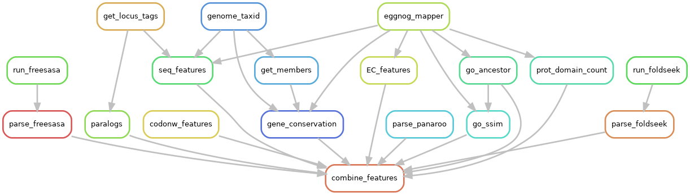
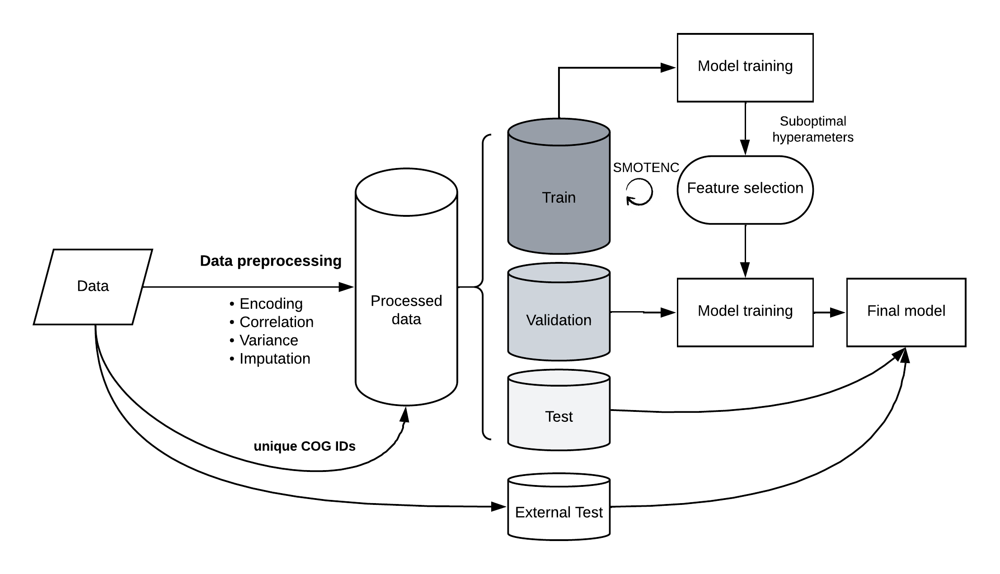

[Back to main page](./../README.md)

<h1 align="center">Projects</h1>

# **Ongoing projects**
[**AMR prediction in clinical isolates**](https://github.com/microbial-pangenomes-lab/2024_AMR_prediction) | July 2024 - Present

[**ML-based trimming of nanopore sequences**](https://github.com/yalwie/ONT_adapter_trimming_tool) | July 2024 - Present

# **PhD projects**

[**Feature extraction pipeline**](https://github.com/microbial-pangenomes-lab/gene_essentiality_features) | March 2021 - Present
* Built a snakemake pipeline to extract sequence-based features from bacterial genomes
* Pipeline takes the genome data of the bacterial strains as input and produces a comprehensive table with the computed features for each gene as an output
* Pipeline implements [egnogg-mapper](https://github.com/eggnogdb/eggnog-mapper), [esearch](https://joshuadull.github.io/APIs-for-Libraries/08-NCBI-E-Utilities/index.html), [FreeSASA](https://freesasa.github.io/), [Foldseek](https://github.com/steineggerlab/foldseek), [CodonW](https://codonw.sourceforge.net/), and [GOATOOLS](https://github.com/tanghaibao/goatools) along with custom python scripts
* Pipeline can be run with command `snakemake -p combine_features -j --cores 36 --use-conda`, where `-p` specifies the rule name, `-j` allows parallel execution of the non-connected rules, `--cores` allocates the required number of CPUs, `--use-conda` allows the python scripts or the required software to be executed in its conda environment.

Fig. Rulegraph of the feature extraction pipeline.

---

[**Bacterial fitness prediction**](https://github.com/microbial-pangenomes-lab/2024_essentiality_prediction) | March 2021 - Present
* Implemented classifiers (XGBoost, Logistic Regression, Random Forest) using the Hydra Python framework.
* Pipeline architecture facilitates model training by allowing configuration files and data pre-processing steps (*e.g.* imputation of missing values) to be switched from the command line. It also allows new data processing or model training steps to be added without rewriting a significant amount of code.

Fig. Model training simplified scheme.

---

[**Code snippets used to generate plots**](https://github.com/ddjamalova/gene-essentiality-prediction-plots) | March 2021 - Present
* This repo contains Jupyter notebooks and Python scripts that are themselves small projects, *e.g.* to perform an [incremental strain inclusion analysis](https://github.com/ddjamalova/gene-essentiality-prediction-plots/notebooks/bootstrap_prediction.ipynb), to assess a [predictive power of sequence-based features](https://github.com/ddjamalova/gene-essentiality-prediction-plots/notebooks/features_predictive_power.ipynb), and to perform a [cross-taxonomy prediction of bacterial essential genes at species, genera, family, and phylum levels](https://github.com/ddjamalova/gene-essentiality-prediction-plots/notebooks/cross_sp_prediction.ipynb). 
* Also, Jupyter notebooks ([1](https://github.com/ddjamalova/gene-essentiality-prediction-plots/notebooks/figure_1.ipynb), [2](https://github.com/ddjamalova/gene-essentiality-prediction-plots/notebooks/figure_2.ipynb), [3](https://github.com/ddjamalova/gene-essentiality-prediction-plots/notebooks/figure_3.ipynb)) contains example scripts to generate various plots.

---

# **Master's project**

[**Code snippets used in Master's project**](https://github.com/ddjamalova/Pangenome) | Sep 2018 - June 2020
* This repo contains python code snippets used in my Master's project titled **Re-classification of species and genera in family of *Bacillaceae***.
* Code snippets can be used to mainly collect bacterial genomes from NCBI Refseq/Genbank.

---

# **Coding practices**

[**ROSALING Solutions**](https://github.com/ddjamalova/ROSALIND_solutions)
* I regularly try to update this repo with the solutions to ROSALIND tasks
* Repo contains Jupyter notebooks named after ROSALIND sections, *e.g.* `Python Village` or `Bioinformatics Stronghold`.
