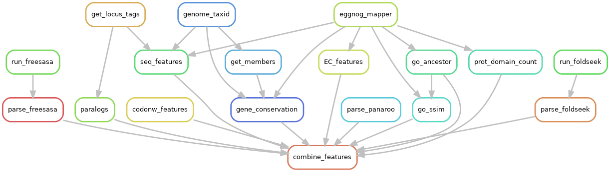

[Back to main page](./../README.md)

<h1 align="center">Projects</h1>

# PhD projects

[Feature extraction pipeline](https://github.com/microbial-pangenomes-lab/gene_essentiality_features) | March 2021 - Present
* Built a snakemake pipeline to extract sequence-based features from bacterial genomes
* Pipeline takes the genome data of the bacterial strains as input and produces a comprehensive table with the computed features for each gene as an output
* Pipeline implements [egnogg-mapper](https://github.com/eggnogdb/eggnog-mapper), [esearch](https://joshuadull.github.io/APIs-for-Libraries/08-NCBI-E-Utilities/index.html), [FreeSASA](https://freesasa.github.io/), [Foldseek](https://github.com/steineggerlab/foldseek), [CodonW](https://codonw.sourceforge.net/), and [GOATOOLS](https://github.com/tanghaibao/goatools) along with custom python scripts
* Pipeline can be run with command `snakemake -p combine_features -j --cores 36 --use-conda`, where `-p` specifies the rule name, `-j` allows parallel execution of the non-connected rules, `--cores` allocates the required number of CPUs, `--use-conda` allows the python scripts or the required software to be executed in its conda environment.

Fig. Rulegraph of the feature extraction pipeline.

---

[Bacterial essential genes prediction](https://github.com/HelmholtzAI-Consultants-Munich/gene-essentiality-prediction) | March 2021 - Present
* Implemented classifiers (xgboost, Logistic Regression, Random Forest) using the Hydra Python framework
* 

Fig. Model training simplified scheme

---

[Code snippets used to generate plots](https://github.com/ddjamalova/gene-essentiality-prediction-plots) | March 2021 - Present
* This repo contains [Jupyter notebooks](), [python scripts]
* 

# Masters project

[Code snippets used in Master's project](https://github.com/ddjamalova/Pangenome) | Sep 2018 - June 2020
* This repo contains python code snippets used in my Master's project titled **Re-classification of species and genera in family of *Bacillaceae***
* Mainly 

# Side projects

[ROSALING Solutions](https://github.com/ddjamalova/ROSALIND_solutions)
* I regularly try to update this repo with solutions to ROSALIND tasks
* Repo contains Jupyter notebooks named after ROSALIND sections, e.g. `Python Village` or `Bioinformatics Stronghold`
